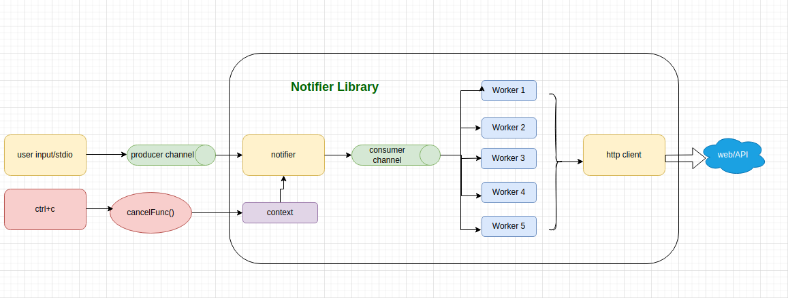
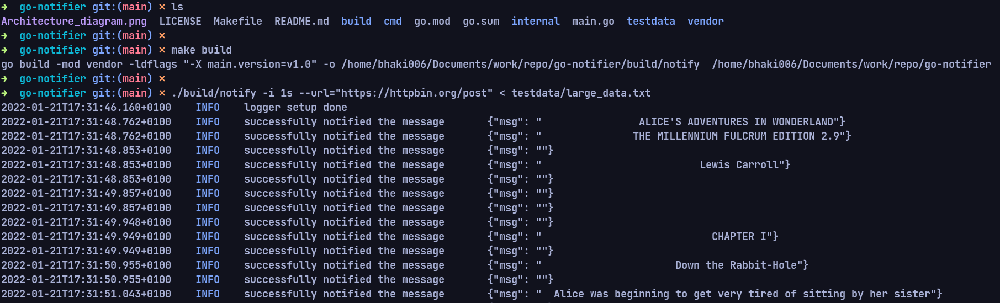
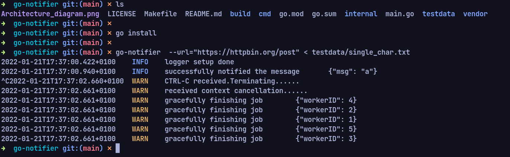

# go-notifier
>* go-notifier is a CLI client which reads a file via stdin and send new message every interval to the configured url(configurable). Each line of the file will be interpreted as a new message that will be notified about.
>
>*   CLI contains a library that implements an HTTP notification client.A client is configured with a URL to which notifications are sent.It implements a function that takes messages and notifies about them by sending HTTP POST requests to the configured URL with the message content in the request body.
client operations are non-blocking for the caller. It handles notification failures.

###Supported operation
```
Usage:
  notifier [flags]

Flags:
  -h, --help                help for notifier
  -i, --interval duration   Notification interval (default 100ms)
  -u, --url string          URL to which notification to be sent 
  ```

###Architecture diagram



# Pre requisites
- Ubuntu 20.04 (any linux based distros) 
- Vim or Goland 2021.3.1
- Go 1.17

# Build & Run
> go-notifier library  is designed to run as a cli which means all business logics as single application.
* Application can be build and started by using Makefile.
* Make sure to cd to project folder.
* Run the below commands in the terminal shell.
* Make sure to run Pre-run and Go path is set properly

# Pre-run
    make mod
    make lint

# How to run unit test
    make test

# How to run build
    make build

# How to start the app
- **1.start using go build (Without go install)**

- **2.start using go install (go path is configured properly)**


>Note: testdata folder contains  different text file which can be used for testing