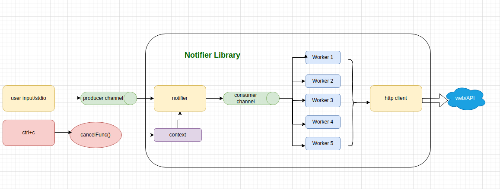

# go-notifier
    
>   go-notifier is a CLI client which reads a file via stdin and send new message every interval to the configured url(configurable). Each line of the file will be interpreted as a new message that will be notified about.
>
>   CLI contains a library that implements an HTTP notification client.A client is configured with a URL to which notifications are sent.It implements a function that takes messages and notifies about them by sending HTTP POST requests to the configured URL with the message content in the request body.
client operations are non-blocking for the caller. It handles notification failures.

###Supported operation
```
Usage:
  notifier [flags]

Flags:
  -h, --help                help for notifier
  -i, --interval duration   Notification interval (default 100ms)
  -u, --url string          URL to which notification to be sent 
  ```

###Architecture diagram



